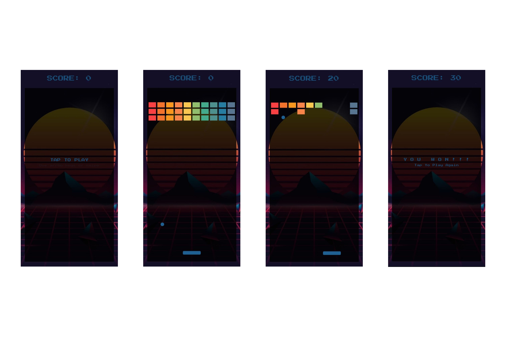

## Flutter Breakout Game with Flame
This repository contains a simple Breakout game built using Flutter and the Flame game engine.

## Screenshots




**Features:**

* Classic Breakout gameplay with ball, paddle, and bricks.
* Responsive controls for mobile devices.
* Simple visual effects and sounds.

**Getting Started:**

1. **Prerequisites:**
    * Flutter development environment set up.
    * Basic understanding of Dart and Flutter development.
    * Familiarity with the Flame game engine is recommended.

2. **Clone the repository:**

```bash
git clone https://github.com/abenezerayalew/breakout.git
```

3. **Install dependencies:**

```bash
cd breakout
flutter pub get
```

4. **Run the app:**

```bash
flutter run
```


**Gameplay:**

* Use the left and right touch controls to move the paddle.
* The ball bounces off the paddle and bricks.
* Breaking all bricks wins the game.
* Losing a life by the ball falling below the screen ends the game.

**Play live:**

* You can play the game live by scanning the following QR code.


```image

```


**Contributing:**

Feel free to fork this repository and contribute your own improvements or features. 

**License:**

This project is licensed under the MIT License. See the LICENSE file for details.

**Note:**

This is a basic example and can be further extended to include additional features, power-ups, levels, and visual enhancements.
